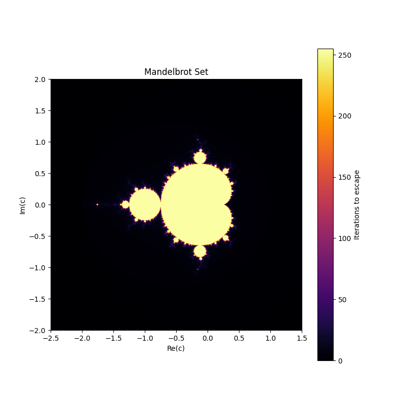

# Mandelbrot and Broccoli Fractal Visualizations

This project generates visualizations of two mathematical constructs:
- **Mandelbrot Set**
- **Broccoli Fractal**

Both are visualized using Python with `matplotlib` and `numpy`.

## Mandelbrot Set

The Mandelbrot Set is a famous fractal defined by the recursive equation:

$$Z_{n+1} = Z_n^2 + C$$

where \( C \) is a complex constant, and the iteration continues until \(|Z| > 2\). Points within the Mandelbrot set never escape this boundary.

**Generated Image:**

## Broccoli Fractal

The Broccoli Fractal is an iterative geometric structure inspired by the fractal nature of broccoli. Starting with a triangle, each iteration adds new vertices, creating a fractal pattern.

**Generated Image:**

## How to Run

1. Ensure you have Python installed with the following libraries:
   - `numpy`
   - `matplotlib`
You can do this using the `requirements.txt` file to download the respective version of each library.
2. Run the respective Python scripts to generate the images.
